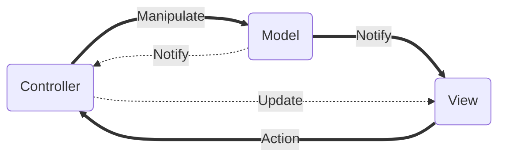
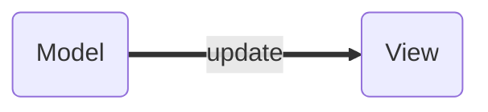
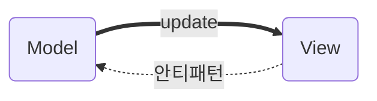
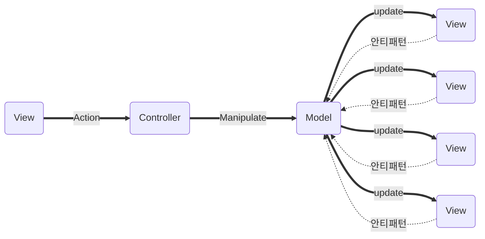
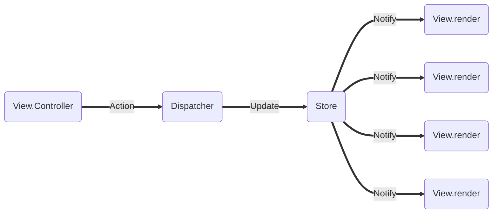
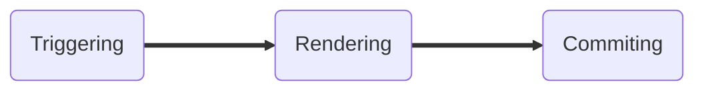
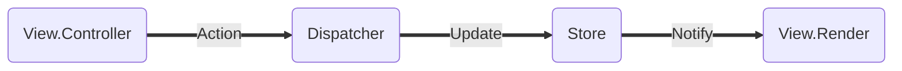
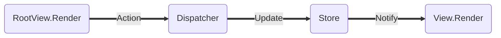
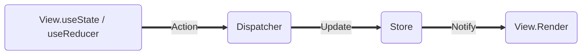

### React란?

[리액트 교과서 - React 살펴보기](https://velog.io/@kyusung/React-%EC%82%B4%ED%8E%B4%EB%B3%B4%EA%B8%B0)

[[React] React.js란? (간단 정리)](https://velog.io/@jini_eun/React-React.js%EB%9E%80-%EA%B0%84%EB%8B%A8-%EC%A0%95%EB%A6%AC)

React를 이해하고 분석하기 위해서는 그 기반에 깔린 중요한 두가지 특징을 이해해야 한다.

1. React는 상태의 단방향 데이터 흐름을 강제함으로써 MVC 패턴의 안티 패턴을 예방한다.
2. React는 SPA를 전제로 상태에 종속된, 각각 독립된 View(컴포넌트)를 조합해 화면을 구성한다.

### SPA(Single Page Application)

[[앵귤러] SPA (Single Page Application)에 대한 고찰](https://paperblock.tistory.com/87)

SPA는 하나의 페이지로 구성된 애플리케이션(단일 페이지 애플리케이션)을 칭하는 용어이다.

- 첫 페이지 요청 시 단 한번만 리소스를 요청하고 이후로는 페이지 리로딩 없이 비동기적으로 필요한 부분만 서버로부터 받아 렌더링한다.
- 네이티브 앱에 가까운 사용자 경험(UX)과 자연스러운 페이지 이동을 제공한다.
- 주로 클라이언트 쪽에서 화면을 구성하므로 Client Side Rendering(CSR)이라고도 불린다.

MPA는 Multiple Page Application의 줄임말로 서버에서 필요한 각 페이지를 받아오는 방식이다.

- MPA는 주로 서버 쪽에서 화면을 구성하므로 Server Side Rendering(SSR)이라고도 불린다.

SPA의 장점은 다음과 같다.

1. 첫 로딩 이후에는 네이티브 앱과 같은 자연스러운 사용자 경험을 제공한다.
2. 페이지를 이동하더라도 필요한 부분만 교체하면 되므로 효율성이 증가한다.
3. 클라이언트 단 로직이 서버 단 로직을 위임받기 때문에 관심사의 분리가 명확해지고 서버 부담이 경감
4. 모듈화, 컴포넌트 개발이 용이하기 때문에 재사용성이 증가한다.
5. 서버 단은 JSON과 같은 통일된 데이터 형식을 제공하기 때문에 웹, 앱 확장에 유리하다.

SPA의 단점은 다음과 같다.

1. 첫 로딩 시에 사이트 구성과 관련된 모든 리소스를 한번에 받기 때문에 초기 구동 속도가 느리다.
    
    → 특정 라우팅 때마다 리소스를 분산해서 로드하는 Lazy Loading 기법을 통해 극복 가능하다.
    
2. 특정 화면이 그려지고 데이터 수신이 완료되는 경우 화면이 바뀌는 모습이 연출될 수 있다.
    
    → 로딩 스피너와 같은 사전 렌더링 화면을 구성하는 Pre Rendering 기법을 통해 보완 가능하다.
    
3. SPA 구조상 중요한 비즈니스 로직이 노출될 우려가 있다.
    
    → 부분적 SSR 도입을 통해 해결할 수 있다.
    
4. 검색엔진 최적화(SEO)가 어렵다.
    
    → Next JS와 같은 프레임워크의 도입을 통해 어느정도 해결할 수 있다.
    

### MVC 패턴

[MVC - 용어 사전 | MDN](https://developer.mozilla.org/ko/docs/Glossary/MVC)

MVC 패턴은 비즈니스 로직과 화면 로직을 구분(관심사의 분리)하는데 중점을 두는 디자인 패턴이다.

Controller는 사용자의 입력(Action)에 대한 응답으로 Model을 Manipulate하는 로직이 포함된다.

cf. Controller는 Model을 거치지 않고 View를 직접 Update 할 수도 있다.

Model은 Controller로부터 지시를 받아 상태를 정의하고 상태 변경시 이를 View에 Notify한다.

cf. Model은 Controller에게 데이터의 상태 변경을 Notify하기도 한다.

View는 앱의 Model을 표현하는 로직을 정의한다. 사용자의 입력(Action)을 Controller에게 전달한다.

### MVC 안티 패턴

MVC 디자인 패턴은 기본적으로 Model과 View의 단방향 데이터 흐름을 지향한다. 

하지만, SPA를 전제로하는 컴포넌트 기반의 개발 방법에서는 Model과 View사이의 양방향 데이터 흐름이 발생하는 안티 패턴이 사용될 여지가 있다.

해당 안티 패턴은 앱의 규모가 커질수록, 새로운 기능을 추가할 때마다 시스템의 복잡도를 기하급수적으로 증가시키고 예측 불가능한 코드를 생산할 가능성이 커진다.

### React - Flux

[[디자인패턴] Flux, MVC 비교](https://beomy.tistory.com/44)

Flux 패턴은 SPA를 전제로 하는 컴포넌트 기반 개발 방법에서 다소 적용하기 어려웠던 MVC 패턴을 약간 변형하여 Model과 View 사이의 양방향 데이터 흐름이 발생하는 안티패턴을 예방하기 위해(단방향 데이터 흐름을 강제하기 위해) 페이스북이 제안한 디자인 패턴이다.

Dispatcher는 모든 데이터의 흐름을 관리하는 허브 역할을 담당한다. 

cf. 전달된 Action을 보고 등록된 콜백함수를 실행하여 Store에 데이터를 전달한다.

Store는 상태 변경을 관리한다.

cf. Dispatcher로부터 받은 데이터를 싱글톤 패턴으로 상태에 적용한다.

cf. 상태가 변경되면 이를 View에게 Notify한다.

View는 상태를 화면에 보여주는 역할과 상태를 관리하는 Controller의 역할을 동시에 담당한다.

cf. View는 컴포넌트라고 봐도 무방할 것 같다.

cf. 자식 View로 데이터를 흘려보내는 View Controller의 역할도 담당한다.

해당 패턴에서 View는 상태를 관리하는 Controller의 역할을 담당하기는 하지만, 직접적으로 상태를 변경하는 것은 오로지 Dispatcher를 통해서만 가능하게 함으로써 단방향 데이터 흐름을 강제한다.

### React - Component

[Render and Commit](https://beta.reactjs.org/learn/render-and-commit)

[Understanding Rendering in React ♻ ⚛️](https://dev.to/teo_garcia/understanding-rendering-in-react-i5i)

본 챕터는 정확히는 위 Flux 패턴을 토대로 View 내부의 프로세스가 어떻게 되는지에 대해 다룬다. 

React는 View가 생성되는 프로세스를 다음과 같이 3가지 과정으로 구분한다.

**STEP1. Triggering**

Triggering은 앞서 설명했던 Flux 패턴의 Action, Update, Notify 과정을 말한다.

React가 제시하는 Trigger가 발동하는 상황과 이를 결정짓는 메서드는 다음과 같다.

1. 컴포넌트의 초기 렌더링 상황

`createRoot` 메서드를 활용해 Root DOM 노드를 타케팅한 후 `render` 메서드를 호출한다.

1. 컴포넌트의 상태가 업데이트된 상황(함수형 컴포넌트 기준)

`useState` 함수의 setter 함수, `useReducer`의 dispatches 함수를 호출한다.

**STEP2. Rendering**

Rendering 단계 역시 두 가지 상황으로 구분해 프로세스를 정의해 볼 수 있다.

1. 컴포넌트의 초기 렌더링 상황

Root 컴포넌트에 중첩된 컴포넌트들을 재귀적으로 호출하여 Virtual DOM Tree를 생성한다.

1. 컴포넌트의 상태가 업데이트된 상황

새로운 Virtual DOM Tree를 생성하고 이를 기존의 Virtual DOM Tree와 비교하는 Reconciliation 단계에 돌입한다. React 16에서 도입된 Fiber는 이전 버전의 Reconciliaion 단계를 최적화한 개념이다.

**STEP3. Committing**

앞선 렌더링 과정에서 생성된 Virtual DOM Tree를 실제 DOM에 반영한다. 

1. 컴포넌트의 초기 렌더링 상황

`appendChild` 메서드를 통해 컴포넌트를 기존 노드에 추가한다.

1. 컴포넌트의 상태가 업데이트된 상황(함수형 컴포넌트 기준)

기존의 노드 트리와의 변경사항을 파악해서 최소한의 DOM Operation만 실행한다.